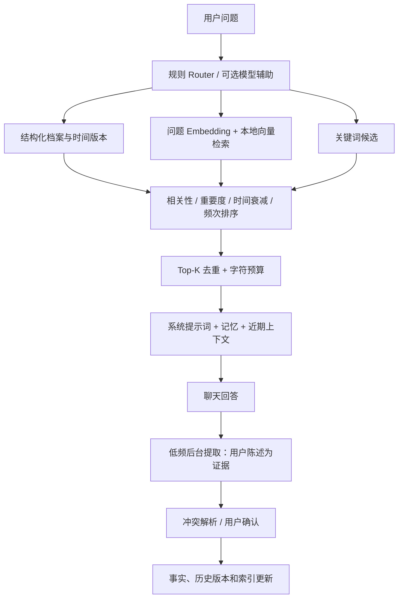

# 混合记忆使用与实现

本轮在原有记忆功能上补齐结构化档案、语义索引、冲突解析、时间版本和排序衰减。源码运行时自动增量迁移原数据库，保留记忆 ID、手动状态和来源。默认使用关键词检索；启用语义能力需要选择 Embedding 供应商与模型。

## 使用

1. 重启源码程序，打开侧栏「记忆」→「语义检索、排序与上下文设置」。
2. 选择 Gemini、已配置的 OpenAI 兼容自定义供应商或本地模型。远程供应商可点击「获取模型」，从下拉列表选择，也可手动填写 Embedding 模型 ID。切换远程供应商时自动获取，选择后点击「保存检索设置」。该配置独立于聊天模型和后台提取模型。
3. 向量维度默认填 `0`，使用模型默认值；保存后点击「建立 / 继续索引」。远程索引会发送允许参考的记忆及历史用户陈述，显示处理进度和错误。
4. 后续只对新增/修改的内容建立向量。普通查询嵌入当前问题，在本地检索并选取 Top-K，默认最多 8 条事实与历史来源合计，历史来源最多 3 个，提示词预算 6000 字符。
5. 更换模型、维度、地址、凭据或本地模型文件后重新建立索引；本地文件发生变化时使用「重建索引」。暂停阻止后续批次，已发出的请求可能等待返回。关闭记忆不调用索引。

Embedding 使用现有供应商配置中的密钥和代理，密钥不存入记忆设置。Gemini 文本模型支持查询/文档任务类型；`gemini-embedding-2` 单条调用避免多输入聚合，使用对应文本前缀。[Google 官方说明](https://ai.google.dev/gemini-api/docs/embeddings)。兼容服务调用 `/embeddings`，支持批量输入、索引顺序校验和可选维度。[OpenAI 官方接口](https://developers.openai.com/api/reference/resources/embeddings/methods/create)。

远程模型发现只请求元数据，不生成向量，不修改聊天模型或已有索引。Gemini 使用模型列表中的 `embedContent` 能力；OpenRouter 使用专用 `/api/v1/embeddings/models` 接口。[OpenRouter 列表接口](https://openrouter.ai/docs/api/api-reference/embeddings/list-embeddings-models)。其他兼容服务使用供应商设置中的模型列表地址（留空则用 API 地址），筛选 Embedding 能力标记；缺少标记时按模型名称识别，因此可能漏掉不常见命名，仍需允许手动输入。不支持列表接口、空结果或请求失败都会显示原因并保留输入。本地模型填写已有目录和标识，不远程下载。

本地模式需要另行安装可选 `sentence-transformers`，填写已下载的模型目录和模型标识。加载时只使用本地文件，按查询/文档编码，缓存模型实例，不自动下载。源码可使用该模式；打包本地模型适配器时需要在构建环境安装该可选依赖。[Sentence Transformers 参数说明](https://www.sbert.net/docs/package_reference/sentence_transformer/model.html)。默认云端/关键词模式不增加依赖。

## 数据与流程

| 模块 | 职责 |
| --- | --- |
| `memory_store.py` / `memory_schema.py` | SQLite 迁移、笔记与类型化事实、有效期、版本、冲突、隐私、导入导出 |
| `memory_embeddings.py` | Gemini、OpenAI 兼容 HTTP、本地模型、归一化与 float32 编码 |
| `memory_vectors.py` | 文档分片、增量索引、缓存、暂停/重试/重建、精确余弦相似度 |
| `memory_resolver.py` | SAME / EXTEND / CONTRADICT / REPLACE / NEW，与操作审计 |
| `memory_hybrid.py` | Router、结构化/向量/关键词候选合并、排序、预算、时间检索与近期摘要 |
| `services/memory_service.py` | GUI/认证 HTTP 统一操作与低频后台提取 |
| `ui/memory_advanced.js` | 结构化编辑、档案、冲突确认、版本、索引和评分解释 |



事实字段包括 `subject`、JSON `value`、`scope`、`confidence`、`importance`、来源、版本和 `valid_from`。例如 `user.os = "Windows 11"`。明确更新自动记忆会沿用记录 ID，并保存旧值的有效期；手动事实、歧义矛盾、低置信度候选和删除建议需要用户确认。拒绝的候选通过内容哈希防止自动反复提出。支持查询「以前」「去年」或指定日期的状态。

后台提取默认开启：至少 3 条新增用户消息，同一会话至少间隔 5 分钟，最多 5 个候选。选择提取供应商/模型时可跟随当前供应商或独立指定。助手输出只帮助理解，不作为用户事实证据；候选需要逐字用户来源，写入和确认时检查来源仍存在。失败不会推进处理计数。

默认排名为 `0.5 × max(semantic, lexical) + 0.2 × importance + 0.2 × recency + 0.1 × frequency`，另加置顶/历史版本权重。`recency` 使用指数衰减，稳定偏好采用更长半衰期；频次取调用次数的对数归一化。衰减降低优先级，保留原记录。记忆中心显示每条召回的得分及组成。

## 范围与隐私

- 当前会话选择 `global` 或项目标识。项目会话默认将自动提取事实放在本项目，只参考全局和当前项目；分叉继承作用域与隐私。改会话作用域影响后续提取和历史检索，已有笔记可单独编辑作用域。明确要求跨项目保存的自动候选先确认。
- 关闭记忆、排除历史、临时聊天和删除来源会使正在进行的旧任务失效。异步结果写回前检查 epoch、来源、内容和版本，避免忘记后被旧请求恢复。
- 忘记、清空和隐私撤回清理派生向量、文档、摘要及 Embedding 缓存；忘记删除该事实的结构记录、全部版本和冲突，并排除相关来源历史。禁用总开关保留可管理的原始笔记。
- 删除聊天保留独立保存的事实，移除来源与原文。临时聊天不读取/提取记忆或参与历史检索；临时聊天的暂存清理仍沿用原有离开/启动流程。
- JSON v2 导出包含当前事实及历史版本；导入兼容 v1/v2，并恢复原有效期。导入作为手动数据，不信任文件中的本机会话 ID 或来源凭证；无效批次整体回滚。

当前实现针对单实例工作区：最多 500 条笔记，每条保留 50 个时间版本；向量历史窗口最多 5000 个用户片段和最近 2000 个版本，结构化时间查询可直接查旧版本。查询缓存最多 128 条，文档缓存最多 10000 条。历史采用重叠分片，排除工具、附件文本和明确凭据；敏感内容识别依赖规则与提取模型，用户可随时关闭、临时聊天或忘记。

长对话可保留最近 12 条完整消息，并用有归属的早期用户/助手摘录摘要减少上下文。含代码块、附件、工具或供应商继续信息时保留完整上下文。摘要可能省略细节，可关闭。默认规则 Router；模型辅助仅用于复杂/历史查询，默认关闭，会有额外模型请求。索引失败自动重试至少间隔 5 分钟；手动建立/重建可立即重试。

## 验证

使用隔离 SQLite、模拟 SDK/HTTP 和固定语义向量验证写入、召回、版本、范围、遗忘、失败、并发与缓存；不读取个人配置，不产生真实 API 消费。

远程模型发现补充后的完整测试为 174 passed、31 subtests passed。桌面/移动 UI 与认证 HTTP 回归验证了模型获取、选择保存、失败重试、过期响应保护、记忆注入和临时清理；此前完整模型配置编辑浏览器回归也已通过。新记忆模块 Ruff 和相关 Python/JS 语法检查通过。详细完成记录见 WORK_PLAN.md。

```powershell
.venv/Scripts/python.exe -m pytest test/ -q
.venv/Scripts/python.exe test/test_memory_benchmark.py
```

固定离线数据集包含 308 条笔记、16 个精确/同义问题、1536 维向量。受控测试中关键词 Recall@3 为 50%，混合链路为 100%，重复查询 Embedding 请求为 0。该结果验证路由、索引、排序及缓存连接正确，不代表真实 Embedding 模型质量；详情见 `scratch/memory-validation.json`。

本轮修改源码与文档，未更新生产服务器或现有 `dist/ClaudeChat.exe`。Windows 浏览器/HTTP 与 SDK 合约已验证；实际 Linux 运行、重新打包及真实供应商召回质量需在对应运行环境验证。
