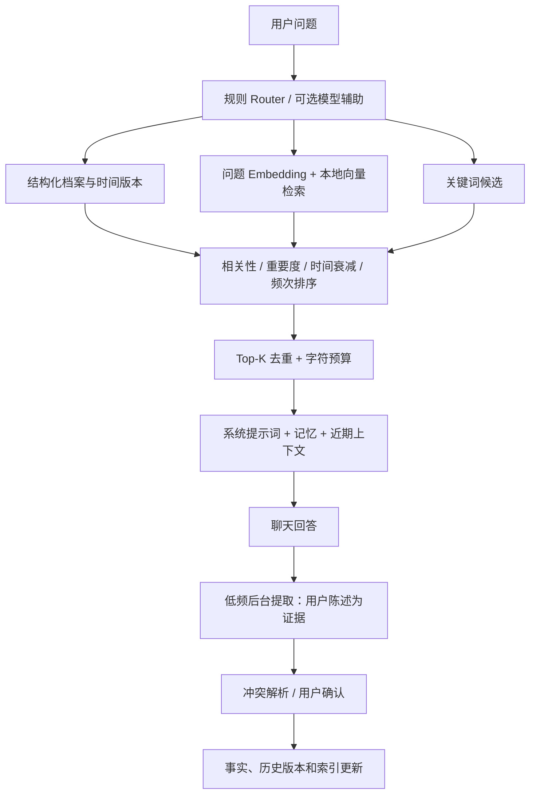

# 混合记忆使用与实现

现在使用「用户事实＋会话话题＋跨会话概览＋原始历史」四层记忆。源码运行时增量迁移原 SQLite，保留事实 ID、手动状态和数据路径。默认可使用关键词检索；Embedding 独立配置，不要求聊天模型具备 Embedding 能力。

## 会话整理与按需查询

在「记忆 → 话题、项目进展与概览」管理话题、来源、版本和后台任务。新讨论在成功回答后闲置至少两分钟整理，自动窗口最短五分钟；后台按完整相关讨论提取话题，再合并跨会话目录。事实提取仍低频独立运行。提取供应商/模型可跟随聊天配置或单独选择，合并也可单独配置；后台不继承聊天思考、强制 JSON、联网、沙盒或记忆工具设置。

旧聊天不会默认全部发送。在旧聊天继续对话时，首次自动会话整理仅处理本次新增讨论，任务明确显示未处理的较早范围。点击「预览历史补整理」，查看会话、待处理字符与预计摘要请求数，选择后启动；概览合并另有低频请求。估计不是费用报价。成功处理才推进游标，失败保留进度并退避重试；暂停跨重启保留，意外中断需手动继续。追加消息复用成功的相同前缀，编辑后重查受影响内容，自动整理不覆盖手动编辑。

话题区分问题、发现、方案、确认结果和待解决事项。助手答案属于建议；确认结果必须有逐字用户确认或实际工具验证。讨论某项技术不会据此推断职业。通过「编辑摘要」「查看证据与版本」纠正描述、查看原文与历史版本；缺少确认依据时保持未解决状态。

新回答直接获取允许范围内的有界资料与目录，再结合当前问题、近期指代及时间范围检索细节。目录明确说明可用总数和本轮返回数。Claude、Gemini、Chat Completions、Responses 可调用 `memory_overview`、`search_memory`、`read_memory_episode`、`read_history_excerpt`，与网页搜索开关独立；模型不能用参数扩大软件授权范围。写入与忘记走独立流程。

每轮回答最多两轮追加查询、累计八秒，概览、自动召回、早期摘录与工具结果共用字符预算。已知模型上下文容量时，按文本/多模态保守估算并预留输出和余量；未知容量时使用配置预算，实际供应商仍可能有更严格限制。明确拒绝工具组合且尚未输出时，用独立文本模型规划检索后重试；否决追加检索后不再绕路召回。

Embedding 失败使用目录和关键词；摘要或合并失败保留原始历史和有效已有摘要。停止后不追加查询，不缓存迟到向量或写回失效来源。后台整理用量显示在任务列表；文本检索规划用量计入本轮回答，本轮查询过程可在来源面板查看。

后台请求使用独立输出预算：会话摘要最多 8192 tokens，概览合并与事实提取最多 4096 tokens。这是上限，实际消耗以供应商报告为准；不继承聊天的工具、思考或强制 JSON 设置。发送给模型的来源使用短编号，本地还原并验证真实引用。空字段及单个证据对象可兼容，无来源的文本或未经用户/工具验证的结论仍拒绝保存。

整理失败不会推进游标。输出截断时缩小输入批次后退避重试；格式、鉴权和配置错误停止自动重试，并显示可定位的原因，修正后点击「继续整理」。超时、限流和临时连接错误有限次退避重试。Responses 截断响应已报告的 token 用量也计入后台任务；供应商未报告时无法准确统计失败请求的消费。重启程序不会清除暂停状态或已经成功处理的进度。

后台任务中的失败/暂停项可点击「重试此任务」独立恢复，底部「继续整理」统一恢复失败/暂停任务。两者保留成功游标，重试会产生实际供应商用量；来源已变化时需重新预览并选择当前会话。暂停/恢复不改变隐私版本，因此随后新增消息仍可复用成功前缀；真正的隐私撤回、遗忘和来源编辑继续失效检查。

普通摘要由软件根据实际引用来源标为用户陈述、助手建议、工具观察或混合未验证内容，用户自己提出的方案不会被强制归为助手建议。自动整理中的错误确认在有效来源存在时降为未验证内容并显示提示；无效来源仍报错，不能静默跳过并推进整批游标。手动确认编辑保持严格来源校验。

会话结论使用 `outcome_update` 的 KEEP/REPLACE/RETRACT 区分未提及、新确认和撤回，并保存撤回证据及历史版本。后来的明确撤回优先于旧确认，重放旧批次不会恢复已撤回结论，后续新的有效确认可以更新结果。否定证据不得作为成功确认；软件对明确否定做保守检查，模型的语义理解仍可能出错，管理面板可查看原文并纠正。

手动修改摘要同步更新当前来源关系、时间范围与历史版本；遗忘按实际当前引用屏蔽来源，旧版遗留的来源关系也会在归档/遗忘时重新核对。原文分片按偏移恢复连续内容，不能跨未处理的间隙拼造逐字证据。

## 使用

1. 重启源码程序，打开侧栏「记忆」→「语义检索、排序与上下文设置」。
2. 选择 Gemini、已配置的 OpenAI 兼容自定义供应商或本地模型。远程供应商可点击「获取模型」，从下拉列表选择，也可手动填写 Embedding 模型 ID。切换远程供应商时自动获取，选择后点击「保存检索设置」。该配置独立于聊天模型和后台提取模型。
3. 向量维度默认填 `0`，使用模型默认值；保存后点击「建立 / 继续索引」。远程索引会发送允许参考的记忆及历史用户陈述，显示处理进度和错误。
4. 后续只对新增/修改的内容建立向量。普通查询嵌入当前问题，在本地检索并选取 Top-K，默认最多 8 条事实与历史来源合计，历史来源最多 3 个，提示词预算 6000 字符。
5. 更换模型、维度、地址、凭据或本地模型文件后重新建立索引；本地文件发生变化时使用「重建索引」。暂停阻止后续批次，已发出的请求可能等待返回。关闭记忆不调用索引。

Embedding 使用现有供应商配置中的密钥和代理，密钥不存入记忆设置。Gemini 文本模型支持查询/文档任务类型；`gemini-embedding-2` 单条调用避免多输入聚合，使用对应文本前缀。[Google 官方说明](https://ai.google.dev/gemini-api/docs/embeddings)。兼容服务调用 `/embeddings`，支持批量输入、索引顺序校验和可选维度。[OpenAI 官方接口](https://developers.openai.com/api/reference/resources/embeddings/methods/create)。

远程模型发现只请求元数据，不生成向量，不修改聊天模型或已有索引。Gemini 使用模型列表中的 `embedContent` 能力；OpenRouter 使用专用 `/api/v1/embeddings/models` 接口。[OpenRouter 列表接口](https://openrouter.ai/docs/api/api-reference/embeddings/list-embeddings-models)。其他兼容服务使用供应商设置中的模型列表地址（留空则用 API 地址），筛选 Embedding 能力标记；缺少标记时按模型名称识别，因此可能漏掉不常见命名，仍需允许手动输入。不支持列表接口、空结果或请求失败都会显示原因并保留输入。本地模型填写已有目录和标识，不远程下载。

本地模式需要另行安装可选 `sentence-transformers`，填写已下载的模型目录和模型标识。加载时只使用本地文件，按查询/文档编码，缓存模型实例，不自动下载。源码可使用该模式；打包本地模型适配器时需要在构建环境安装该可选依赖。[Sentence Transformers 参数说明](https://www.sbert.net/docs/package_reference/sentence_transformer/model.html)。默认云端/关键词模式不增加依赖。

## 数据与流程

| 模块 | 职责 |
| --- | --- |
| `memory_store.py` / `memory_schema.py` | SQLite 迁移、笔记与类型化事实、有效期、版本、冲突、隐私、导入导出 |
| `memory_embeddings.py` | Gemini、OpenAI 兼容 HTTP、本地模型、归一化与 float32 编码 |
| `memory_vectors.py` | 文档分片、增量索引、缓存、暂停/重试/重建、精确余弦相似度 |
| `memory_resolver.py` | SAME / EXTEND / CONTRADICT / REPLACE / NEW，与操作审计 |
| `memory_hybrid.py` | Router、结构化/向量/关键词候选合并、排序、预算、时间检索与近期摘要 |
| `services/memory_service.py` | GUI/认证 HTTP 统一操作与低频后台提取 |
| `ui/memory_advanced.js` | 结构化编辑、档案、冲突确认、版本、索引和评分解释 |



事实字段包括 `subject`、JSON `value`、`scope`、`confidence`、`importance`、来源、版本和 `valid_from`。例如 `user.os = "Windows 11"`。明确更新自动记忆会沿用记录 ID，并保存旧值的有效期；手动事实、歧义矛盾、低置信度候选和删除建议需要用户确认。拒绝的候选通过内容哈希防止自动反复提出。支持查询「以前」「去年」或指定日期的状态。

后台提取默认开启：至少 3 条新增用户消息，同一会话至少间隔 5 分钟，最多 5 个候选。选择提取供应商/模型时可跟随当前供应商或独立指定。助手输出只帮助理解，不作为用户事实证据；候选需要逐字用户来源，写入和确认时检查来源仍存在。失败不会推进处理计数。

默认排名为 `0.5 × max(semantic, lexical) + 0.2 × importance + 0.2 × recency + 0.1 × frequency`，另加置顶/历史版本权重。`recency` 使用指数衰减，稳定偏好采用更长半衰期；频次取调用次数的对数归一化。衰减降低优先级，保留原记录。记忆中心显示每条召回的得分及组成。

## 范围与隐私

- 当前会话选择 `global` 或项目标识。项目会话默认将自动提取事实放在本项目，只参考全局和当前项目；分叉继承作用域与隐私。改会话作用域影响后续提取和历史检索，已有笔记可单独编辑作用域。明确要求跨项目保存的自动候选先确认。
- 关闭记忆、排除历史、临时聊天和删除来源会使正在进行的旧任务失效。异步结果写回前检查 epoch、来源、内容和版本，避免忘记后被旧请求恢复。
- 忘记、清空和隐私撤回清理派生向量、文档、摘要及 Embedding 缓存；忘记删除结构记录、版本和冲突，并排除支持消息，保留其他独立来源。禁用总开关保留可管理的原始笔记。
- 删除聊天保留独立保存的事实，移除来源与原文。临时聊天不读取/提取记忆或参与历史检索；临时聊天的暂存清理仍沿用原有离开/启动流程。
- JSON v3 导出包含事实、话题、历史版本与来源引用；兼容 v1/v2/v3 原子导入。外部内容保持未验证标记，不信任文件中的本机会话 ID 或来源凭证；导入话题的确认结论降为未验证发现，编辑后仍保持外部身份。

当前实现针对单实例工作区：最多 500 条笔记，每条保留 50 个时间版本；向量历史窗口最多 5000 个用户片段和最近 2000 个版本，结构化时间查询可直接查旧版本。查询缓存最多 128 条，文档缓存最多 10000 条。历史采用重叠分片，排除工具、附件文本和明确凭据；敏感内容识别依赖规则与提取模型，用户可随时关闭、临时聊天或忘记。

长对话可保留最近 12 条完整消息，并用有归属的早期用户/助手摘录摘要减少上下文。含代码块、附件、工具或供应商继续信息时保留完整上下文。摘要可能省略细节，可关闭。默认规则 Router；模型辅助仅用于复杂/历史查询，默认关闭，会有额外模型请求。索引失败自动重试至少间隔 5 分钟；手动建立/重建可立即重试。

## 验证

使用隔离 SQLite、模拟 SDK/HTTP 和固定语义向量验证写入、召回、版本、范围、遗忘、失败、并发与缓存；不读取个人配置，不产生真实 API 消费。

四层升级使用隔离 SQLite、模拟供应商流和离线向量、桌面/移动 Edge 与认证 HTTP 验收。覆盖证据类型、长输入进度、编辑/遗忘/临时隐私、项目限制、取消、预算及导入版本。最新结果见 MEMORY_UPGRADE_PLAN.md；开发检查不调用真实付费模型或下载本地模型。

```powershell
.venv/Scripts/python.exe -m pytest test/ -q
.venv/Scripts/python.exe test/test_memory_benchmark.py
```

固定离线数据集包含 308 条笔记、16 个精确/同义问题、1536 维向量。受控测试中关键词 Recall@3 为 50%，混合链路为 100%，重复查询 Embedding 请求为 0。该结果验证路由、索引、排序及缓存连接正确，不代表真实 Embedding 模型质量；详情见 `scratch/memory-validation.json`。

本轮修改源码与文档，未更新生产服务器或现有打包程序。Windows 浏览器/HTTP 与 SDK 合约已验证；实际 Linux 运行、重新打包及真实供应商召回质量需在对应运行环境验证。

## 来源与编辑一致性补充（2026-10-08）

历史事实版本现在保存各条支持证据，删除/修改/忘记来源后不再借用当前事实的其他来源。升级前缺少完整证据的旧版本保留在数据库中供诊断，但不参与自动召回。Embedding外发前复查原始来源；已经发送的网络请求无法撤回。

记忆查询结果不会成为新的执行验证来源；网页和未知工具保持观察，实际执行工具的成功迹象才可确认。用户愿望、疑问和推测保留为未验证内容。规则仍不能完全证明自然语言结论的语义与相关性，可查看来源并手动纠正。

摘要编辑遇到版本变化会拒绝保存并保留草稿，请重新读取最新摘要后对照修改。导入先展示冲突，默认跳过现有事实；可选择替换（清除当前旧来源并标记外部未验证）或独立保存。重复导入未选择替换时保存条数可能为0。

重启源码后，在记忆中心的“话题、项目进展与概览”中选择“记忆用量”。它按工作区分别统计后台整理和聊天内检索路由/规划，保存成功、失败、取消、超时和截断请求已经报告的token；未知字段明确显示“未知”，不表示免费。后台任务原数字只统计整理/合并，不能替代此账本。

账本自升级后开始记录，旧消费无法补算；Embedding、主聊天和标题请求不计入该文本记忆请求账本。聊天内部分规划用量已经包含在回答总数中，请勿把两处数字直接相加。字符数估算不会当成供应商报告，统计不是人民币费用或供应商账单。最终390项+47子测试、HTTP/Edge手机与桌面验收结果见MEMORY_REMEDIATION_PLAN.md。
