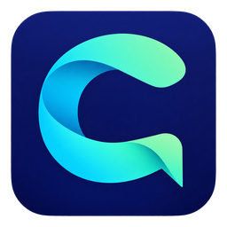

# Chatudex 中文文档



[English](./README.md) | **简体中文**

Chatudex 是一个功能强大的桌面 GUI / Web 客户端，支持 **Claude (Anthropic)**、**DeepSeek** 和 **Google Gemini** API，基于 **pywebview** 与现代网页技术构建。界面参考 **Nebula Chat** 的简洁布局，支持亮色、暗色与跟随系统主题，支持多平台 AI 切换、流式对话响应、联网搜索集成、文件附件上传、可折叠的推理思维轨迹（Reasoning/Thinking Steps）、离线本地静态资源、自定义系统提示词管理器、Artifacts 沙盒预览侧边栏、本地代码沙盒终端以及多平台命令行快速部署。

---

## 核心特性

项目已由 Claude Chat 更名为 Chatudex。新启动入口为 `chatudex.py`，原有 `claude_chat.py` 命令仍然可用。现有配置、凭据和 `claude_chat.db` 聊天记录兼容沿用，内部 Python 包名保留为 `claude_chat`。

### 🤖 多平台 AI 支持
- **Claude (Anthropic)** — 完整支持，包括 Extended Thinking 推理思维（自适应/启用模式）、多模态视觉、PDF 解析以及原生联网搜索。
- **DeepSeek** — 完整对话支持，包括 DeepSeek-V3 与 DeepSeek-R1（推理思维）。支持基于 Tool-call 的智能联网搜索。
- **Google Gemini** — 完整支持，包括动态发现的 Gemini 模型与推理模型。支持原生 Google Search Grounding 联网搜索。
- **即时模型切换** — 顶栏支持即时切换平台和模型。支持平台感知的安全校验，防止跨平台模型请求错误（例如将 Claude 模型发送给 Gemini 接口）。
- **动态模型列表** — 在后台自动从各平台 API 获取最新的可用模型列表；若网络不可用，则无缝降级到内置的备用模型列表。

### 🔍 联网搜索
- **集成的网页检索** — 可在会话中开启/关闭联网搜索。支持 Google、Bing、DuckDuckGo、Tavily (API) 和 Jina (API) 搜索引擎。
- **实时搜索卡片 UI** — 搜索时会显示精致的雷达扫描动画卡片；展开后可查看搜索结果的网页标题、链接和摘要。搜索卡片会持久化保存至对话历史中。
- **深度网页阅读** — AI 可通过本地提取器或 Jina Reader API 深度抓取并阅读完整的网页正文内容。
- **平台原生搜索** — Claude 使用 Anthropic 原生 search 工具；Gemini 使用内置的 Google Search Grounding；DeepSeek 使用基于 Tool-call 的联网搜索。

### 📎 文件附件与视觉
- **Claude & Gemini** — 原生多模态：支持拖拽或上传图片（PNG/JPG/GIF/WebP）与 PDF 文档，直接作为 API 内容块发送。
- **DeepSeek** — 纯文本 API：自动通过 OCR 或本地 PDF 解析器提取图片和文档内容，并以文本块形式发送。
- **OCR 引擎** — 自动模式下智能选择最佳 OCR 引擎：多模态模型直接使用原生视觉，纯文本模型则自动使用本地 EasyOCR 或云端 OCR (Gemini Flash) 解析。可在设置中配置。
- **纯文本文件读取** — 支持读取 `.py`, `.js`, `.md`, `.json`, `.csv`, `.sql` 等 30 多种文本格式，并自动将其注入为代码块。

### 🧠 推理思维链 (Reasoning)
- **Claude** — 支持自适应（adaptive）和启用（enabled）思维模式，可配置思考 Token 预算及推理强度级别。
- **DeepSeek-R1 / Gemini 2.0 Flash Thinking** — 推理过程将以折叠面板形式展示，支持实时输出和预估 Token 计数。
- 推理设置将按对话会话进行持久化保存。

### 🎨 界面与移动端
- **亮色 / 暗色 / 跟随系统** — 侧栏底部与设置中的主题控制即时切换，并在当前浏览器持久化。手机使用侧栏抽屉、精简顶栏、可展开工具及适配屏幕/软键盘的输入区与弹窗。
- **设置工作区** — 左侧搜索和分类导航，右侧一次展示一个页面：常规、外观、提示词预设、模型连接、模型参数、自定义服务、文件解析、网络与服务。采用分组卡片与开关，适配手机屏幕。切换分类保留编辑内容，点击「保存设置」应用配置；主题即时生效。保存时若模型参数无效，会自动打开对应页面显示错误。
- **Artifacts 侧边栏沙盒预览** — 独立的右侧侧边栏，支持 SVG 矢量图渲染、在沙盒 `<iframe>` 中隔离执行 HTML 网页、以及利用本地 `mermaid.js` 实时渲染流程图与结构图。
- **系统提示词管理器** — 在「设置 → 提示词预设」保存和编辑系统提示词，也可从侧栏「助手预设」直接进入；在聊天顶部切换使用的预设。
- **一键中止生成** — 随时点击切断流式输出，并在自动保存已生成内容的同时，在会话中标记 `🚫 已中止` 状态。
- **重试 / 编辑 / 分叉** — 允许重新生成最新回复、编辑并重发任何历史消息，或从任意消息节点分叉出一个全新的对话。
- **原始数据包审查** — 点击消息卡片上的 `📦` 图标，即可查看该消息在 SQLite 数据库中的原始记录和发送/接收的 API Payload JSON。

### 🧠 长期记忆
- **混合存储** — 类型化事实/用户档案与本地 float32 向量，使用 SQLite 持久化；历史用户陈述按片段索引。独立选择 Gemini、兼容服务或可选本地 Embedding 模型，支持增量索引、暂停/继续、重建、缓存和明确的关键词降级。
- **混合召回** — Router 合并结构化、向量、关键词与近期上下文；综合相关度、重要度、指数时间衰减及调用频次。默认 Top-K 共 8 条、历史最多 3 个来源、记忆预算 6000 字符，可调节并逐条查看得分。模型辅助路由默认关闭。
- **低频整理** — 默认开启，至少 3 条新增用户消息且同一会话至少间隔 5 分钟，最多 5 个候选。可跟随当前供应商/模型，或选择官方/自定义供应商与独立模型。只采信当前仍存在的逐字用户陈述；助手内容仅帮助理解。自动整理有额外模型消耗。
- **冲突与版本** — 支持新增、更新、合并、删除和忽略；明确更新保存旧值有效期，手动记忆、歧义矛盾、低置信度候选和删除建议进入确认流程。可查看档案、来源、时间版本、处理记录及本次调用。
- **范围与隐私** — 全局/项目作用域、关闭记忆、排除历史、临时聊天与后台任务失效检查。忘记同步删除相关版本与派生数据；清空排除已有历史。删除聊天保留独立笔记、去除来源及原文；分叉继承作用域和隐私。临时对话仍沿用离开/启动时清理机制。
- **完整管理** — JSON v2 导出包含版本，兼容 v1/v2 原子导入并恢复有效期，不信任外部来源 ID。长会话可用带用户/助手归属的早期摘录摘要，保留近期完整消息；含代码/工具/附件的复杂上下文保留完整，摘要可关闭。
- **当前范围** — 最多 500 条笔记、每条 50 个版本；向量窗口包含最多 5000 个历史用户片段和最近 2000 个版本，结构化时间查询可直接查询旧版本。实际召回质量与敏感资料识别取决于模型和规则，不承诺复现商业系统内部实现。参见[设置、架构与验证说明](MEMORY_GUIDE.md)。

### 🛠️ 开发与高级特性
- **本地代码沙盒终端** — 支持在客户端本地安全执行模型输出的 Python/Javascript 代码块，并在下方实时生成交互式终端，支持 stdin 输入和手动终止进程（需在设置中手动开启以保证安全性）。
- **全方位安全防护** — 针对 AI 输出的渲染层进行了严格的 DOMPurify 净化，防范 XSS 注入；并采用安全的隔离环境渲染 Mermaid 图表与 SVG 矢量图。
- **代理配置** — 支持系统代理（继承环境变量）、直连无代理、或自定义 HTTP 代理服务器 URL。
- **安全凭证加密存储** — 在 Windows 系统下自动调用系统 `keyring` 将 API Key 安全存入系统保险箱；在 Linux/Termux 等无图形化环境下，自动降级为基于设备指纹和 PBKDF2/AES-GCM-256 的高强度本地加密存储。
- **SQLite 数据库底层** — 所有对话与消息列表均持久化存储于本地的 `claude_chat.db` 数据库中。首次启动时，程序会自动将 `conversations/` 下的老版本 JSON 对话文件迁移至 SQLite 并归档备份。
- **纯 Web 服务器模式 (Headless)** — 自动适配无 GUI 环境，支持在 Linux 服务器、Android Termux (手机端) 等环境下一键作为 Web 聊天室部署，支持局域网多设备访问。
- **离线优先静态资源** — `marked.js`, `highlight.js`, 和 `mermaid.js` 均为本地依赖，不请求外部 CDN。

---

## 环境要求

- **Python 3.10+**
- 至少一个平台的 API Key：
  - **Anthropic Claude** — [console.anthropic.com](https://console.anthropic.com)
  - **DeepSeek** — [platform.deepseek.com](https://platform.deepseek.com)
  - **Google Gemini** — [aistudio.google.com](https://aistudio.google.com)
- 互联网连接

---

## 快速安装与运行

### 方案 A：Windows 系统 (一键自动配置)

我们提供了 Windows 环境下的虚拟环境一键安装脚本，会自动创建本地虚拟环境、升级 pip、安装全部依赖包以及 Ruff、PyInstaller 打包工具：

1. **配置环境**：
   - 双击运行 **`setup_venv.bat`** (CMD 版本) 
   - 或在 PowerShell 中执行 **`setup_venv.ps1`**
2. **运行程序**：
   配置完成后，你可以随时通过下面的命令运行应用（优先启动桌面 GUI 窗口，如果 webview 库加载失败则自动降级为 Web 服务模式）：
   ```bash
   .venv\Scripts\python.exe chatudex.py
   ```

### 方案 B：Linux / macOS / Android Termux 部署 (作为局域网 Web 聊天室)

1. **创建虚拟环境并安装依赖**：
   ```bash
   python3 -m venv .venv
   source .venv/bin/activate
   pip install --upgrade pip
   pip install -r requirements.txt
   ```
2. **启动移动 Web 服务**：
   ```bash
   # 绑定 0.0.0.0 允许同局域网设备通过浏览器访问，指定运行在 8000 端口
   python chatudex.py --server --host 0.0.0.0 --port 8000
   ```
   启动后，直接在其他设备的浏览器中输入 `http://<服务器IP>:8000` 即可开始使用。

### 方案 C：Windows 可执行文件一键打包 (无 Python 环境运行)

你可以将程序编译为单个独立的 `.exe` 文件：

1. 激活虚拟环境：
   ```bash
   call .venv\Scripts\activate.bat
   ```
2. 运行打包构建脚本：
   ```bash
   python build_executable.py
   ```
3. 编译完成后，您可以在生成的 **`dist/Chatudex.exe`** 找到独立运行包，支持快速拷贝拷贝和快速运行部署。

---

## 依赖说明

| 依赖包 | 版本要求 | 用途描述 |
| :--- | :--- | :--- |
| `pywebview` | >=5.0 | 桌面 GUI 窗口容器 |
| `anthropic` | >=1.2.0 | Anthropic Claude SDK |
| `openai` | >=1.0.0 | DeepSeek (OpenAI 兼容) SDK |
| `google-genai` | >=1.0.0 | Google Gemini SDK |
| `Pillow` | >=10.0.0 | 图像处理支持 |
| `keyring` | >=24.0.0 | 操作系统级安全凭证存储 |
| `httpx` | >=0.24.0 | 联网搜索及其他集成的 HTTP 客户端 |
| `httpx2` | >=2.0.0,<3 | Anthropic SDK 1.x 使用的 HTTP 客户端 |
| `cryptography` | >=42.0.0 | 凭证加密存储 |
| `beautifulsoup4` | >=4.12.0 | 网页内容解析 |

文件解析依赖随 `requirements.txt` 一起安装：`pypdf>=4.0.0`、`python-docx>=1.1.0`、`openpyxl>=3.1.0`、`python-pptx>=0.6.23`。

可选安装 `easyocr`，用于纯文本平台的本地图片文字识别。

---

## 项目结构

```text
Claude_chat/
├── chatudex.py          # 应用启动入口文件
├── requirements.txt        # 核心依赖项列表
├── setup_venv.bat          # Windows CMD 一键配置脚本
├── setup_venv.ps1          # Windows PowerShell 一键配置脚本
├── build_executable.py     # PyInstaller 打包脚本
├── pyproject.toml          # 项目元数据与 Ruff 格式化配置
├── claude_chat/            # 核心业务源码目录
│   ├── __init__.py         # 包初始化
│   ├── app.py              # GUI 与流式任务生命周期
│   ├── api_bridge.py       # GUI 与 HTTP 共用的服务入口
│   ├── services/           # 配置、会话、文件、执行及模型服务
│   ├── http_router.py      # HTTP 参数验证与路由分发
│   ├── config.py           # 配置与凭证安全管理器
│   ├── db.py               # SQLite 数据库持久化层
│   ├── search.py           # 统一网页搜索引擎接口
│   ├── attachment_parser.py# 附件解析器与 OCR 管道
│   ├── server.py           # 局域网 Web 服务器实现 (Headless)
│   ├── clients/            # 多平台 API 客户端模块
│   │   ├── __init__.py     # 客户端模块导出
│   │   ├── base.py         # 分别构建 httpx/httpx2 客户端及共享工具
│   │   ├── claude.py       # Anthropic Claude 流式客户端
│   │   ├── deepseek.py     # DeepSeek (OpenAI 兼容) 流式客户端
│   │   ├── gemini.py       # Google Gemini 流式客户端
│   │   ├── dispatcher.py   # 平台路由与统一流式入口
│   │   └── models.py       # 动态模型列表获取
│   └── ui/                 # Web 前端静态资源
│       ├── index.html      # 主页面 HTML 布局
│       ├── style.css       # 基础组件样式，workspace.css 提供明暗主题与移动布局
│       ├── settings.css    # 设置侧栏、分类页面、分组行与移动布局
│       ├── fonts.css       # 字体定义
│       ├── api.js          # API 通信层
│       ├── chat.js         # 聊天消息管理
│       ├── dom.js          # DOM 操作工具
│       ├── events.js       # 事件处理与快捷键
│       ├── main.js         # 应用初始化与流式回调
│       ├── model_picker.js # 可搜索模型选择器
│       ├── select_picker.js# 可搜索下拉框适配
│       ├── model_config_editor.js # 模型请求参数编辑器
│       ├── settings.js     # 设置面板逻辑
│       ├── state.js        # 应用状态管理
│       ├── ui.js           # UI 渲染与组件
│       ├── utils.js        # 通用工具函数
│       └── libs/           # 离线打包 JS 依赖库
├── config.json             # 运行时配置 (Git 已忽略)
├── claude_chat.db          # SQLite 数据库 (Git 已忽略)
└── conversations_backup/   # 已迁移的 JSON 对话备份 (Git 已忽略)
```

---

## 配置文件参考 (`config.json`)

```json
{
  "active_platform": "claude",
  "model": "claude-sonnet-4-6",
  "temperature": 1.0,
  "max_tokens": 16000,
  "thinking_enabled": false,
  "thinking_type": "adaptive",
  "thinking_budget": 16000,
  "thinking_level": "high",
  "enable_web_search": false,
  "web_search_engine": "google",
  "web_page_parser": "local",
  "proxy_mode": "system",
  "proxy_url": "",
  "ocr_mode": "auto",
  "ocr_cloud_model": "gemini"
}
```

---

## 快捷键与操作

| 快捷键 | 触发操作 |
| :--- | :--- |
| `Ctrl+Enter` | 发送当前输入的消息 |
| `Shift+Enter` | 输入框换行 |

---

## 代理配置模式

1. **System proxy (系统代理)** — 自动继承并读取操作系统的环境变量（如 `HTTP_PROXY`, `HTTPS_PROXY`）。
2. **No proxy (无代理)** — 强制直连，忽略所有系统级代理配置。
3. **Custom proxy (自定义代理)** — 手动指定具体的代理网关服务器（如本地代理 `http://127.0.0.1:10809`）。

---

## 命令行参数一览

| 参数选项 | 全称 | 说明 |
| :--- | :--- | :--- |
| `-s` | `--server` | 强制以纯 Web 服务模式 (Headless) 运行，不显示本地图形窗口 |
| | `--host <ip>` | 指定 Web 服务绑定的网卡 IP (如 `0.0.0.0` 代表绑定所有网卡，默认为 `127.0.0.1`) |
| `-p` | `--port <port>` | 指定 Web 服务的监听端口号 (默认: `8000`) |


## OpenAI Responses 适配器

DeepSeek 设置中也提供 **使用 Responses API** 开关：默认关闭时走 Chat Completions，开启时沿用 DeepSeek 的 API 地址和密钥调用 Responses。地址必须支持 `/responses`。两种模式分别保留模型参数；切换后保存设置即可生效。DeepSeek 的 PDF/Office 仍在本地解析。Responses 模式下，联网搜索开关启用 DeepSeek 服务端 `web_search`，使用现有 DeepSeek 密钥，无需额外搜索密钥。界面显示搜索过程并保存记录；原生推理和搜索上下文会随历史回传以支持多轮对话。Chat Completions 模式保留原有搜索引擎设置。详见 [DeepSeek 官方文档](https://api-docs.deepseek.com/zh-cn/guides/responses_api/)。

在设置中新增或编辑自定义供应商，将协议适配器选为 **OpenAI Responses + Files**，填写 API Base URL（例如 `https://api.openai.com/v1`）、API Key 和模型 ID。供应商需支持 `/responses`；发送图片/PDF 还需要 `/files` 接口以及支持相应输入的模型。

自定义供应商适配器支持流式文字、推理摘要、系统提示词、图片/PDF、token 统计和停止生成。模型参数使用 `max_output_tokens` 和 `reasoning.effort`，已有 Chat Completions 的 token/推理等级参数会在预览时转换。聊天历史由本地管理，默认 `store: false`；供应商返回的加密推理上下文随回复保存，仅在相同地址、凭据和模型下复用。自定义供应商尚未开放内置搜索、代码执行和 MCP 工具；上方 DeepSeek 专用模式支持官方搜索与明文推理上下文。

## 自定义模型 ID

在设置中选择供应商，点击模型设置区域的 **自定义模型 ID**，输入供应商支持的准确模型 ID 并保存。该 ID 会直接用于 API 请求，刷新模型列表或接口返回空列表后仍会保留。各供应商的 ID 分别保存到 `manual_model_ids`，互不混用；添加 ID 本身不会开通模型访问权限。供应商选择器会将自定义供应商单独分组显示。

## 更新 Linux 部署

在已有项目目录中激活虚拟环境，然后执行：

```bash
git pull --ff-only
python -m pip install -r requirements.txt
python -m pip check
```

通过原有进程管理工具重启服务。如果此前手动启动，请停止旧进程后重新运行：

```bash
python chatudex.py --server --host 0.0.0.0 --port 8000
```

### Claude 报错 `Invalid http_client` / `httpx2.Client`

Anthropic SDK 1.x 要求使用 `httpx2` 中的对象。传入 `httpx.Client` 会在初始化客户端时失败，此时尚未发送 API 请求。这是 SDK 兼容问题，各操作系统都可能出现。Claude 聊天、模型列表和云端图片文字识别统一使用 `claude_chat/clients/base.py` 中的 `build_anthropic_http_client()`；其他集成保留独立的 HTTP 客户端构造函数。

需要同时更新代码和依赖，然后重启服务。仅安装 `httpx2` 不会改变仍在创建 `httpx.Client` 的旧代码。请用服务实际使用的 Python 环境检查：

```bash
python -c "import sys, anthropic, httpx2; print(sys.executable); print('anthropic', anthropic.__version__); print(httpx2.Client)"
```

## 开发验证

在项目环境中安装测试与检查工具：

```bash
python -m pip install pytest ruff
python -m pytest test/ -q
python -m pytest test/test_anthropic_http_client.py -q
node test/test_model_picker.js
node test/test_platform_select.js
```

Claude HTTP 回归测试保留真实 SDK 的客户端类型检查，仅模拟 API 方法，不需要密钥或联网，覆盖模型列表和云端图片文字识别。JavaScript 检查需要 Node.js。其他检查及独立集成脚本见 `AGENTS.md`。

设置界面浏览器回归（Windows，需安装 Edge 和 Playwright）：

```bash
node test/test_settings_navigation_browser.js
node test/test_model_config_editor_browser.js
```

若 Playwright 位于项目外，将 `PLAYWRIGHT_MODULE` 指向其模块路径；模型编辑器检查需将 `PYTHON_EXECUTABLE` 指向项目环境的 Python。这些测试使用本地资源和模拟 API，覆盖分类导航、排除凭据值的设置搜索、跨页编辑、校验、保存失败、主题、手机布局和模型参数编辑。
